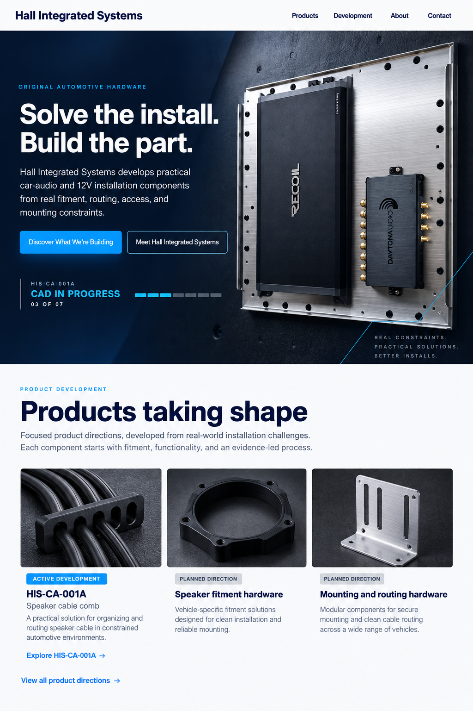

# Hall Integrated Systems Option 3 Site Refresh

**Status:** Selected visual direction documented for review

**Date:** September 16, 2026

**Repository:** `Hall-Integrated-Systems/SITE`

**Working branch:** `codex/option-3-homepage-refresh`
**Selected direction:** Option 3, with the clearer product-category cues from Option 2

## 1. Decision

Hall Integrated Systems will keep its evidence-led honesty while changing the public site's first impression from an engineering ledger to a confident automotive product company.

The selected direction uses a dramatic, product-led hero with one memorable statement: **“Solve the install. Build the part.”** The first screen will establish the company, show real physical-work context, identify the active product-development stage, and offer one clear path into the product pipeline. A lighter section immediately below will reveal the range of product directions and encourage visitors to continue exploring.

The implementation will retain the current static HTML, CSS, and JavaScript architecture, current routes, contact transport, Microsoft Clarity integration, and the evidence boundaries already encoded in the site and tests.

## 2. Visitor outcome

A first-time visitor should understand within a few seconds that:

1. Hall Integrated Systems develops original automotive audio and 12V installation hardware.
2. The company starts with real fitment, routing, access, and mounting problems.
3. Products are actively being developed, with their current state reported honestly.
4. There is a growing product pipeline worth exploring and following.
5. The company operates with a deliberate, professional development process.

The design should create attention through contrast, decisive language, authentic hardware imagery, and visible momentum. It should create trust through precise status labels, restrained claims, and a consistent technical presentation.

## 3. Scope

### In scope

- Redesign the global header, footer, typography hierarchy, spacing, colors, buttons, and content surfaces.
- Rebuild the homepage around the selected Option 3 direction.
- Carry the refreshed visual system across Products, the HIS-CA-001A dossier, Development, About, Contact, Privacy, and Sitemap pages.
- Shorten navigation labels while preserving existing URLs.
- Improve page titles, descriptions, canonical metadata, and social-preview metadata using existing approved content and assets.
- Preserve and update analytics events for the new navigation and calls to action.
- Update the existing automated tests to protect the refreshed hierarchy and truth boundaries.
- Verify desktop and mobile layouts, keyboard behavior, reduced-motion behavior, links, images, and contact-form validation.

### Out of scope

- Store, checkout, pricing, preorders, reservations, inventory counts, shipping, or availability dates.
- Claims that a product is tested, production-ready, certified, patented, sold, or available unless new explicit evidence is provided.
- Customer testimonials, review scores, partner logos, license claims, customer counts, or other unsupported credibility signals.
- A framework migration, build process, external font, icon CDN, or new third-party frontend dependency.
- A new logo or a change to the legal company identity.
- Changes to the Azure contact service or its recipient configuration.
- Production deployment or merge before the completed implementation is reviewed.

## 4. Truth and asset rules

The visual design may feel aspirational; the public claims must remain literal.

- The hero's amplifier/DSP mounting image is a **photographed installation prototype/reference**, not HIS-CA-001A. Its caption and layout must not imply otherwise.
- HIS-CA-001A remains at **CAD in progress, stage 03 of 07** until new evidence supports a change.
- The active product uses the reviewed CAD work-in-progress derivative already in the repository.
- Planned categories use “Planned direction,” “Concept visualization,” or equivalent visible labels.
- AI-assisted imagery remains visibly disclosed and is never described as a physical prototype or current CAD.
- Real photographs retain descriptive captions and alt text.
- The selected ImageGen mockup is a design reference. It is not itself a production asset.
- No equipment-model update will be inferred. The About story will remove unnecessary equipment-inventory detail and keep the public narrative focused on the development capability.

## 5. Information architecture

Routes stay unchanged to preserve external links and search continuity:

- `/index.html` — company-first homepage and product discovery.
- `/products.html` — product-development index.
- `/products/his-ca-001a-cable-comb.html` — active product dossier.
- `/design-fabrication.html` — company development process.
- `/about.html` — founder and company story.
- `/contact.html` — inquiry path and existing form.
- `/privacy.html` — privacy information.
- `/sitemap.html` and `/sitemap.xml` — human and search-engine indexes.

The primary navigation labels become:

- **Products** → `products.html`
- **Development** → `design-fabrication.html`
- **About** → `about.html`
- **Contact** → `contact.html`

The Hall Integrated Systems wordmark links to the homepage. Each route retains a visible and programmatic current-page state.

## 6. Visual system

### Palette

- Deep navy: primary dark surface and brand anchor.
- Electric cobalt: primary action and active state.
- Cyan: technical guide, progress, and focus accent.
- Aluminum silver and cool gray: hardware context and secondary surfaces.
- White: navigation, editorial sections, and high-contrast copy surfaces.
- Near-black: image overlays and technical depth.

The implementation will consolidate these into CSS custom properties. Cyan is used sparingly for state and direction, not as decoration across every edge.

### Typography

Use only Arial, Helvetica, and system sans-serif fallbacks. Distinction comes from scale, weight, line length, and spacing.

- Hero heading: bold, compact line height, approximately 56–80 px across desktop breakpoints.
- Page headings: approximately 40–58 px.
- Section headings: approximately 30–44 px.
- Body: 16–18 px with a comfortable 60–70 character line length.
- Eyebrows and evidence labels: uppercase, concise, and letter-spaced.

### Shape and surfaces

- Maximum content width: approximately 1,220 px.
- Corners: restrained 6–8 px radius.
- Borders: thin and functional.
- Shadows: limited to important image or interactive elevation.
- Photography: large enough to establish material quality and real-world context.
- No glassmorphism, pill overload, decorative dashboards, or nested card grids.

## 7. Homepage design

### 7.1 Header

Use a white sticky header with the Hall Integrated Systems wordmark on the left and the four primary routes on the right. The selected route uses a clear cobalt or navy state. The header should feel quiet so the hero carries the visual impact.

On mobile, the existing accessible navigation toggle remains. The open state becomes a full-width navy panel below the header with large tap targets and visible focus.

### 7.2 Hero

The hero is a dark, high-contrast editorial composition with copy on the left and the photographed amplifier/DSP mounting prototype on the right. The photograph may be cropped responsively, but the hardware remains recognizable and undistorted.

Use this content:

- Eyebrow: `ORIGINAL AUTOMOTIVE HARDWARE`
- Heading: `Solve the install. Build the part.`
- Body: `Hall Integrated Systems develops practical car-audio and 12V installation components from real fitment, routing, access, and mounting constraints.`
- Primary action: `Discover What We're Building` → `products.html`
- Secondary action: `Meet Hall Integrated Systems` → `about.html`

The hero includes a compact development signal separated from the photograph:

- `ACTIVE PRODUCT DEVELOPMENT`
- `HIS-CA-001A`
- `CAD IN PROGRESS`
- `STAGE 03 OF 07`

The progress indicator uses text and structure as well as color. The photograph receives a concise disclosure identifying it as a photographed prototype/reference. The page must not visually bind that photograph to the HIS-CA-001A product identity.

### 7.3 Products taking shape

The first light section begins immediately after the hero.

- Eyebrow: `PRODUCT DEVELOPMENT`
- Heading: `Products taking shape`
- Intro: `Focused product directions, developed from real-world installation challenges. Each component starts with fitment, functionality, and an evidence-led process.`

It presents three exploration paths:

1. **HIS-CA-001A 4-Wire Speaker Cable Comb** — `Active development`; use the reviewed CAD work-in-progress derivative and link to its dossier.
2. **Speaker fitment hardware** — `Planned direction`; use the approved product-lineup concept visualization with a visible concept disclosure and link to the relevant location on the Products page.
3. **Mounting and routing hardware** — `Planned direction`; use photographed installation context or the approved full product-lineup visualization with an accurate evidence label.

Images remain complete compositions rather than arbitrary crops. Each item has a concise description and a clear link. The section ends with `View all product directions` → `products.html`.

### 7.4 Why HIS builds

A concise two-column section connects real installation problems to company-owned products. One side uses authentic installation photography; the other explains the sequence:

`Observe the constraint → define the part → model it → print it → evaluate it → revise it.`

The action `See the development process` links to `design-fabrication.html`.

### 7.5 Current development

The existing seven-stage system remains, but it becomes a compact editorial rail rather than the dominant first content block. HIS-CA-001A remains the example. Verified and pending evidence stay explicit, with a link to the dossier.

### 7.6 Founder/company band

A short closing band introduces Tyler Hall and the company's aviation-informed problem-solving approach without retelling the full founder story. It links to About and supports the professional company identity behind the products.

### 7.7 Closing action

The final call to action invites visitors to explore product development or contact the company with a relevant inquiry. It does not imply ordering or immediate availability.

## 8. Supporting pages

### Products

Lead with the active product and its current proof. Planned products follow as a structured list with short category descriptions and clear “Planned direction” labels. Reduce repeated cautionary prose by placing one strong explanation near the top and concise next-proof notes inside each record.

### HIS-CA-001A dossier

Preserve every evidence boundary and status gate. Restyle the dossier with the new dark/light system, improve scanability, and make the revision record, current evidence, and pending checks easy to compare. Keep “not available for sale” visible while the product is unfinished.

### Development

Use a compact hero and a clean eight-step process. Replace long uninterrupted text blocks with grouped evidence gates and authentic supporting photography. The page continues to describe the company's own product pipeline, not contract manufacturing or installation services.

### About

Retain the founder story and its personal voice. Reduce the hero title so it wraps naturally, place the founder/company purpose first, and move longer narrative sections into readable editorial blocks. Remove unnecessary printer-model inventory detail; describe the capability without introducing a new model claim.

### Contact

Use a compact, professional hero and retain the existing accessible form, honeypot, validation, Azure endpoint, and public email. Improve the introductory copy so visitors know which inquiries are useful: product-development questions, prototype feedback, and company information.

### Privacy and Sitemap

Apply the shared shell and typography without expanding their content or importance.

## 9. Interaction and accessibility

- Preserve semantic landmarks and one logical `h1` per page.
- Retain visible labels for all contact fields.
- Connect inline errors to fields with `aria-describedby` and preserve `aria-invalid` updates.
- Keep status names visible; color is never the only state signal.
- Keep focus outlines at least 3 px and clearly visible on light and dark surfaces.
- Maintain 44 px minimum interactive targets.
- Ensure DOM order matches the visual reading order when the hero stacks on mobile.
- Respect `prefers-reduced-motion` and avoid required motion.
- Use descriptive alt text and visible evidence captions.
- Confirm zoom and narrow-width reflow without horizontal page scrolling.

## 10. Analytics and search presentation

- Preserve the existing Microsoft Clarity site ID on all public pages.
- Preserve product-detail, Development, contact, email, and external-link events.
- Add distinct events for the hero product action, product-direction exploration, and founder/company action.
- Keep current route paths and update titles/descriptions to match the new company-first positioning.
- Add canonical URLs and Open Graph metadata using approved existing assets.
- Update `sitemap.xml` only for accurate modified dates; do not invent dates.
- Do not make content claims based on unavailable or unverified search data.

## 11. Technical implementation

The site remains a dependency-free static project:

- Plain HTML pages.
- One shared CSS file with consolidated tokens and responsive rules.
- One shared JavaScript file for navigation, analytics events, and the contact form.
- Existing Azure Static Web Apps deployment workflow remains unchanged unless testing finds a deployment-specific defect.
- Existing contact API remains unchanged.
- Existing public asset paths remain valid where practical.

The implementation should remove superseded CSS only after every route has been migrated to the refreshed component classes. It should avoid unrelated refactoring.

## 12. Verification

Before review, the implementation must pass:

1. Existing Node test suite, updated for the approved hierarchy and navigation labels.
2. New assertions for hero copy, calls to action, truthful evidence labels, and product-stage ordering.
3. Static link and referenced-asset checks across all HTML routes.
4. Local browser review at desktop, tablet, and mobile widths.
5. Keyboard navigation through header, calls to action, product links, and contact form.
6. Reduced-motion and focus-state inspection.
7. Contact validation testing without sending a live inquiry.
8. Console-error inspection on every public route.
9. Side-by-side visual comparison with the selected Option 3 reference.

## 13. Delivery

Implementation will be committed on `codex/option-3-homepage-refresh`. A reviewable pull request may be created after local verification. Merging to `main` triggers the Azure Static Web Apps production workflow, so merge remains a separate final action after visual and content review.
